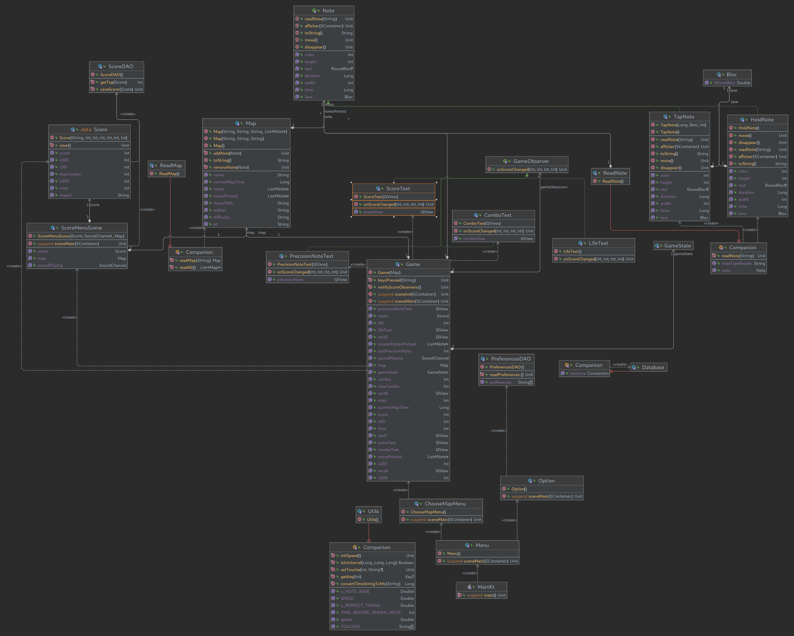

# Uso


## Fonctionnement

Uso est un jeu de rythme inspiré par Osu! (mania). Le but étant de cliquer au bon timing sur les rectangles qui descendent. Les touches de bases sont A Z E R (A étant le bloc le plus à gauche et R le bloc le plus à droite)

## Différentes vues

Nous avons 5 vues différentes : 

 - **Menu :** Cette vue va permettre de choisir où aller entre le choix des maps et les options (touches)
 - **Option :** Cette vue va permettre d'éditer les touches de jeu en fonction des préférences
 - **ChooseMapMenu :** Cette vue va afficher une liste des maps et va les affichers sous forme de bouton. Lors du clique sur un bouton cela va lancer la vue de jeu de cette map
 - **Game :** Cette vue va gérer tout le jeu en fonction de la map
 - **ScoreMenuScene :** Cette vue va afficher le dernier score réalisé.

## Les 3 Design pattern utilisés

**Singleton :** Au sein de database.Database, nous utilisons un singleton pour la base de données afin d'avoir une unique connexion à celle-ci et ne pas les dupliquer.

**Strategy :** Nous lisons les maps depuis un fichier texte et celles-ci peuvent avoir plusieurs types de notes (TAP, HOLD par exemple). Afin de lire une note nous lisons le String de la ligne depuis le fichier texte et en fonction nous utilisons l'algorithme adéquat pour lire (par exemple au sein de HOLD, il y aura la durée afin de tenir la touche)

**Observer :** Au sein de la vue Game, nous avons un affichage de combo, de score, de vie et de la précision de la dernière note. Lorsqu'on update une de ces valeurs, nous appelons la fonction notifyObservers() qui va modifier la vue et donc le texte

## Fonctionnalités non implémenté

Nous avons pas eu le temps de finaliser toutes les fonctionnalités pensées:

- Nous n'avons pas gérer la HOLD note mais le design pattern pouvant lire celle-ci a été fait
- Nos vues ne sont pas toutes avec de beaux designs mais parfois seulement le strict minimum
- La synchronisation entre la musique et le temps est parfois mal fait. A ne pas trop prendre en compte
- L'affichage des différents scores réalisés sur la map ainsi que un affichage avec difficulté et auteur

## Diagram

(voir diagram/Uso.png)



## Creation de map 

Exemple du fichier d'une map :

```
name:crazy frog
author:mael
difficulty:1
music:crazy_frog.mp3
TAP,0:01:00,A
TAP,0:04:01,B
TAP,0:10:01,C
TAP,0:40:50,D
HOLD,0:20:00,0:21:00,A
```

Pour créé sa propre map :

```
name: Nom de la map
author: Nom de l'auteur
difficulty: Difficulté
music: Nom du fichier de musique (qui doit être dans le même dossier que ce fichier)
TAP: TAP, time of the note, button of the note
HOLD: HOLD, start time of the hold, end time of the hold , button of the hold
```

